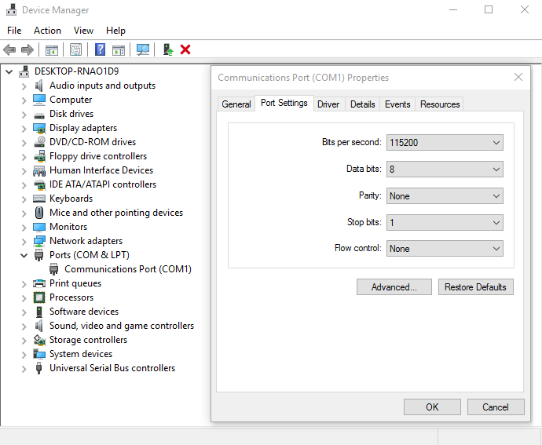

# Sharing HID devices with KVM virtual machine


## The problem

I run KVM virtual machines for various things. Occasional gaming is one of those things. After i assembled new intel-based build (sorry AMD, buldozzer just did not cut it =\) i noticed a critical difference from my AMD build. On Sabertooth 990FX R2 back panel had different sets of USB sockets handled by different USB controllers. What i did was pass-through one USB controller to VM and it gave exclusive access of several USB ports to VM. Pair that with KVM switch and i had easy way to flip between VM and host. With Gigabyte GA-X99-UD4 motherboard all usb slots on back panel belong to same USB controller. Other two USB controllers handle internal USB headers and what not. Now this is a problem. I do not want to take away PC case front USB ports from host and i surely can not reserve entire back panel for VM. Libvirt to the rescue!


## The solution

Libvirt is great and i already use it for managing my VMs. Turns out it already can do what we need. We will set everything up so with press of a button we can detach mouse and keyboard from the host and attach it to the guest. After that we will set up guest to have a hotkey to detach mouse and keyboard and reattach it to the host. Think software KVM switch. We will be using `virsh attach-device` / `virsh detach-device`.

## Method

While looking for solution on the internets i found [Samuel's blog](http://sholland.org/thoughts.html#2016-02-29) where he describes a method of moving individual USB ports between controllers and passing through entire controller to a VM. Sounds like what we need right? But it also sounds way too complex. Samuel attached COM port to a VM and connected it to a daemon running on host. That is exactly what we need. VM can send commands to host. It is not complicated and easy to implement. Daemon on the host handles commands and attaches/detaches our HID devices to where needed. Sounds like a solid plan.

## Dependencies

### On Linux

* python 2.7 and 3.3+
* socat

### On Windows

* powershell
* Autohotkey

## On the host

### Server

I love python and this sounds like perfect project for it. Also [Samue's script](http://sholland.org/files/usbserver) served as a good starting point. This is my cleaned up and improved version (saved to `/usr/local/bin/usbserver`). It automatically creates xml files needed by libvirt to attach/detach devices.

```python
    #!/usr/bin/env python3

    import os
    import socketserver
    import subprocess
    from syslog import syslog


    def change_usb_state(vm, action, device):
        xml_path = '/tmp/device-{}.xml'.format(device)
        if not os.path.exists(xml_path):
            with open(xml_path, 'w+') as fp:
                fp.write("""
                    <hostdev mode='subsystem' type='usb'>
                        <source>
                            <vendor id='0x{}'/>
                            <product id='0x{}'/>
                        </source>
                    </hostdev>
                """.format(*device.split(':')))
        return subprocess.call(['virsh', action+'-device', vm, xml_path]) == 0


    class PCIHandler(socketserver.StreamRequestHandler):
        def handle(self):
            for line in self.rfile:
                action_str = line.strip().decode("utf-8")
                action = action_str.split(' ')
                if len(action) == 3 and action[1] in ('attach', 'detach') and ':' in action[2]:
                    if change_usb_state(*action):
                        syslog("[VMusb] {} {}ed device {}".format(*action))
                    else:
                        syslog("[VMusb] {} {}ing device {} failed".format(*action))
                else:
                    syslog("[VMusb] invalid action: {}".format(action_str))


    class ThreadedTCPServer(socketserver.ThreadingMixIn, socketserver.UnixStreamServer):
        pass


    ThreadedTCPServer('/var/run/vm-usbserver.sock', PCIHandler).serve_forever()

```

I chose to write this script for python3 because i have both versions installed anyway and i simply love new python features too much. If you are overly pedantic and do not wish to maintain two python versions on your machine or simply stuck in the past then adapting this script to python2 will be exercise for you ;)

### Service

But if it does not run it is useless therefore we make it be systemd service. Create file `/etc/systemd/system/usbserver.service` with contents:

```ini
[Unit]
Description=VM HID usb server

[Service]
ExecStart=/usr/local/bin/usbserver

[Install]
WantedBy=multi-user.target
```

Do not forget to enable and start: `systemctl enable usbserver.service; systemctl start usbserver.service`.

### The hotkey

Actual hotkey binding will not be covered here. There are many different ways to go. I just defined a global shortcut in plasma settings because i use plasma5 desktop. Other alternative may be xbindkeys script if you do not use desktop that provides global shorcuts. What will be detailed here is a script that is invoked by hotkey. Essentially what we want to do is run this as root:

`echo 'vm_name attach vendor_id:device_id' | socat - UNIX-CONNECT:/var/run/vm-usbserver.sock`

But i have several virtual machines therefore i made a little bit more intelligent (python) script which attaches devices to very first running VM. This works in my case because i run just two VMs and only one is online at a time since they both have physical gpu bound to them. Carefully consider your requirements before blindly using this script! I again opted in for python because it simply was easier and faster to query libvirt for running machines via it's python bindings. Invoke this script passing list of `vendor:device` IDs and it will send message to our usbserver to attach them to first running VM. Script uses `socat`.

```python
    #!/usr/bin/env python2
    import libvirt
    import sys
    import logging
    from subprocess import Popen, PIPE, STDOUT


    def attach_usb(name, usb_id, retry=5):
        for i in range(retry):
            try:
                p = Popen(['socat', '-', 'UNIX-CONNECT:/var/run/vm-usbserver.sock'], stdout=PIPE, stdin=PIPE, stderr=PIPE)
                p.communicate(input='{} attach {}'.format(name, usb_id))
            except Exception as e:
                logging.exception(e)
                continue
            if p.returncode == 0:
                return True
            else:
                time.sleep(1)
        return False


    if __name__ == '__main__':
        conn = libvirt.openReadOnly(None)
        if conn == None:
            print('Failed to open connection to the hypervisor')
            sys.exit(1)

        try:
            domains = conn.listDomainsID()
        except:
            print('Failed to find the main domain')
            sys.exit(1)

        if len(domains) > 0:
            dom0 = conn.lookupByID(domains[0])
            domain_name = dom0.name()
            for hid_id in sys.argv[1:]:
                attach_usb(domain_name, hid_id)
        else:
            print('No online domains')

```

Hint: To get `vendor:device` id do `lsusb`, its here: "Bus 004 Device 002: ID **045b:0210** Hitachi, Ltd"

Hint: Python 2.7 must be used for this script because libvirt bindings do not support python3 at the time of writing.

## On the guest

Host part was pretty extensive. Luckily on the guest we have to do very little. First add a serial port. I used `virt-manager`.

1. `Add Hardware` button in VM hardware details
2. `Serial`
3. Device type: Unix socket (unix)
4. Path: /var/run/vm-usbserver.sock
5. Mode Client mode (connect)

Now VM has COM1 port through which we can communicate to our usbserver running on host. Then we make a powershell script `detach.ps1` that will instruct our daemon to detach keyboard/mouse from the VM and reattach it to the host:

```powershell
    function detach-device
    {
        $port = New-Object System.IO.Ports.SerialPort COM1,115200,None,8
        $port.Open()
        $port.WriteLine("vm_name detach " + $args[0])
        $port.Close()
    }

    detach-device "vendor:device"
    detach-device "vendor:device"
```

As you can see you should replace `vm_name` with name of your VM as well as `vendor:device` with usb ids of your keyboard and mouse.

Warning! You will likely have to go to windows Device Manager > Ports (COM & LPT) and set `Bits per second` to 115200. 

### Hotkey

And finally hotkey. I will use autohotkey to launch powershell script we just made:

```
^PrintScreen::
  Run Powershell "C:\Users\User\Documents\detach-hid\detach.ps1"
  return
```

It binds to `Ctrl+PrintScreen`. I used same hotkey on the host. And we are done. With press of a button we can toggle USB devices of our choice between host and VM all without need of sacrificing entire USB controller.

Cheers!
