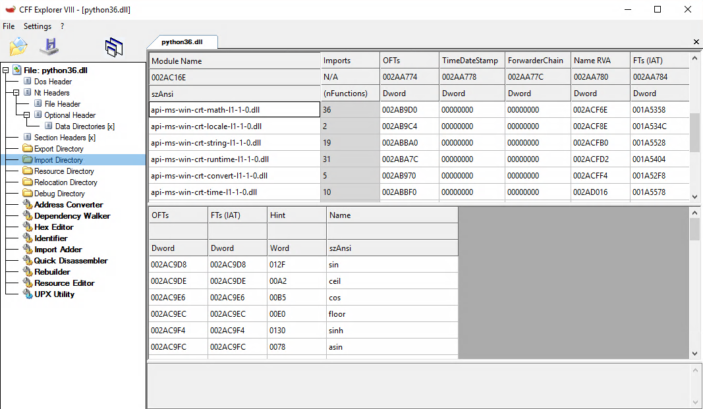
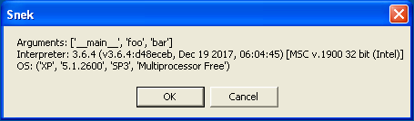

Memory-loaded python anywhere
=============================

A while back whiff of inspiration led me to research interesting problem. I knew of [pupy](https://github.com/n1nj4sec/pupy/) for some time and there were things i did not like. Most unfortunate (mis)feature of `pupy` is depending on python 2.7 forever.. It is year 2017 and i am one of those people who constantly advocate switching to python 3. So i thought to myself - i can do better. Here is a method how to load a modern python (3.6+) interpreter all from memory, supporting native extensions and running on anything from Windows XP and up.

## Goals

* Run on any windows version from XP and up
* Run latest version of python interpreter
* Run a stock version of python interpreter downloaded from https://python.org
* Support loading of native extensions
* Never touch disk

## Course of action

I did the most obvious thing with least (but not little) amount of work from my end solving each of listed goals. To achieve all of listed goals used a modified version of [reflective dll loader](https://github.com/stephenfewer/ReflectiveDLLInjection). Process looks something like this:

1. Create a zip file containing precompiled (pyc) stdlib + user application + any native dlls or native extensions
2. Create a self-contained  "bootloader" executable which will load user application from said zip
3. Add a new section to bootloader executable and put zip file there
4. Upon execution bootloader will do following:
  1. Check it's sections, finds section that contains embedded zip file
  2. Load native dlls
  3. Load native extensions
  4. Load python interpreter
  5. Load precompiled stdlib and user application code
  6. Initialize python runtime
  7. Execute code in `__main__.pyc` (user application entry point)

All of this is done without writing anything to disk. All python API required to bring up interpreter is loaded at runtime. This process uses same machinery that python application freezers like `cx_Freeze` or `Py2Exe` use.

## Python compatibility

Python is not really incompatible with old operating systems. Yes, developers no longer make effort to run on XP (and rightfully so), but (as of python 3.6) the only difference standing between python interpreter and Windows XP is interpreter using few new operating system APIs and compiler settings.

### New APIs

Python 3.6 is a generous version and not many new APIs are used, only two: `GetTickCount64` and `GetFinalPathNameByHandleW`. These functions must be reimplemented and provided to application being loaded. Their custom implementations are [here](https://github.com/rokups/snek/blob/master/win32/winxp.c). And this is where reflective loader modifications come in. I had to rework loader in such a way that it supported returning fake values when certain APIs failed to load. Core of this behavior is implemented [here](https://github.com/rokups/ReflectiveLdr/blob/master/ReflectiveLdr.cpp#L741-L804).

### Compiler settings

The most important compiler setting we care about is `PlatformToolset`. Later python versions use standard platform toolset like `v140`. This brings a load of stuff that does not exist on Windows XP.



These are [Universal C Runtime](https://blogs.msdn.microsoft.com/vcblog/2015/03/03/introducing-the-universal-crt/) dlls. Microsoft tried to solve dll hell again. But only for newer OSes. Our goal is to run unmodified python runtime so we must make applications linking to said DLLs work. From memory. These files are bundled in application zip file and loaded by reflective loader. Loader is also modified in such a way that it keeps track of libraries it loaded reflectively and allows importing API from them.

## Other interesting details

Order of adding DLLs to the zip file is important and files must follow a dependency order: ucrt dlls > native extensions > interpreter dll. Zip files will be enumerated in the same order they were written to the zip file. This ensures that importing API will always find their imports either provided by system DLLs or by previously memory-loaded files.

In order to bring up python interpreter we need to use API from `python3x.dll`. API can not be imported as usuall in order to prevent creation of dependency of this DLL. It would break our requirement of not touching file system. Each used API is "marked" by using macro with API name: `PY_R_IMPORT_FN(Py_IsInitialized);`. This creates a variable in current scope with a function pointer that can be used.

User application may receive a list of arguments provided by `sys.argv` as well. Arguments are saved in a text file inside the zip.

`Py_FrozenFlag` is set to `1`. `sys.frozen` will return `True`. User code may use it to detect whether it is being loaded from memory or running as usual from the file system. `sys.argv[0]` is set to `__main__` as well.

## Conclusion

This was an interesting exercise. Python is growing in popularity and a leary appealing option for red-teams. Most security-oriented python products that require running on target machines are stuck in python 2.7 though. This research should solve most if not all problems preventing use of fresh versions. That said - code is not of top quality (being a research project). A good idea would be to clean up both `snek` and `ReflectiveLdr` projects from c++-isms to bring executable size down. On the other hand bootloader executable is mere 170KB in size. On it's own - not so tiny. On the other hand packing a tiny application creates 5.4M zip making loader executable size largely irrelevant.

Python Loader: https://github.com/rokups/snek
ReflectiveLdr: https://github.com/rokups/ReflectiveLdr



## Bonus

```py
import sys
import platform
import ctypes

text = f'Arguments: {sys.argv}\n' +\
       f'Interpreter: {sys.version}\n' +\
       f'OS: {platform.win32_ver()}'

ctypes.windll.user32.MessageBoxW(0, text, 'snek', 1)
```

[Sample.zip](uploads/memory-loaded-python-anywhere/Sample.zip) - everything needed to run simple script above.
[Sample.exe.zip](uploads/memory-loaded-python-anywhere/Sample.exe.zip) - bootloader executable with `Sample.zip` embedded into it. Runs on Windows XP. Even though this executable is benign - be a responsible citizen and run it only in a VM.

P.S. You are probably thinking that provided sample executable and code in `snek` repository does not run from memory. That is true. But produced executable is self-contained-enough to do so, using RunPE method for example.
